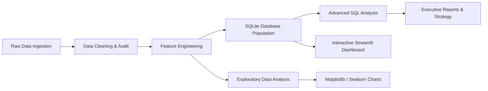
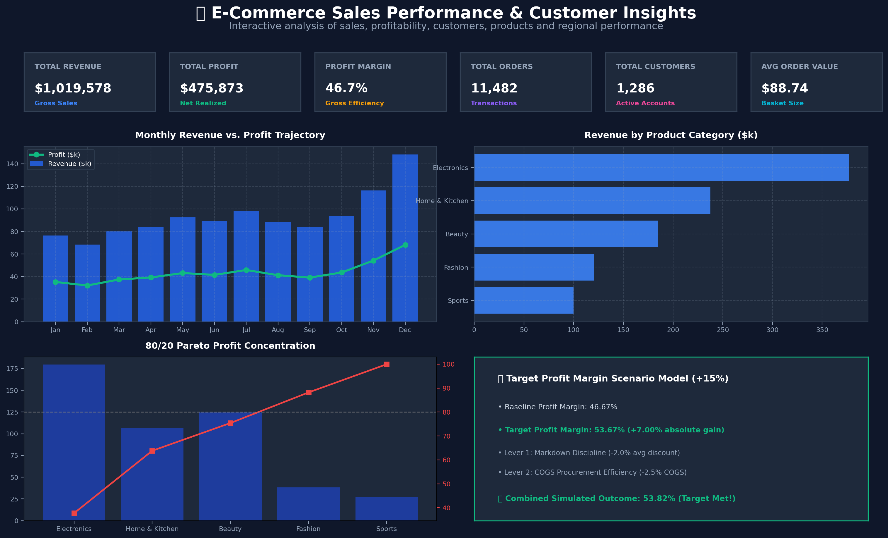

# 📊 E-Commerce Sales Performance & Customer Behavior Analysis

> **An End-to-End Professional Data Analytics Portfolio Project**  
> Diagnosing retail revenue drivers, uncovering promotional margin leakage, segmenting high-value customer cohorts, and modeling strategic levers toward a **+15% profit margin improvement**.

[](https://www.python.org/)
[](https://pandas.pydata.org/)
[](https://www.sqlite.org/)
[](https://streamlit.io/)
[](https://plotly.com/)
[](LICENSE)

---

## 1. Project Overview
This project delivers a comprehensive, production-grade commercial analytics audit for a multi-category e-commerce retailer. By systematically cleaning transactional data, engineering analytical features, querying relational SQLite tables, and deploying an interactive Streamlit dashboard, this project bridges the gap between raw data engineering and executive decision-making.

```
[Raw Data] ──► [Pandas Cleaning] ──► [Feature Eng] ──► [SQLite DB] ──► [SQL Analytics] ──► [Streamlit App & Reports]
 11,560 rows     52 dups dropped       Time & RFM       Relational      Window Funcs         Interactive UI
```

---

## 2. Business Problem
An established online retailer has maintained consistent customer traffic and steady order volume, but suffers from **stagnant revenue growth and decelerating profit margins**.

### Core Management Inquiries:
1. Which products and categories drive top-line revenue versus net gross profit?
2. Which product lines suffer from margin leakage due to excessive promotional discounts?
3. Which geographic territories are underperforming, and where are the expansion opportunities?
4. How do sales and profit trends fluctuate across monthly and quarterly seasons?
5. Who are the highest-value VIP customers, and what is our revenue concentration risk?
6. What concrete, data-backed operational actions can realistically bridge the gap toward improving quarterly profit margin by **15% relative**?

---

## 3. Project Objectives
- **Data Engineering & Audit:** Build an automated data ingestion and cleaning pipeline with a complete audit trail.
- **Exploratory Data Analysis (EDA):** Quantify catalog unit economics, sales volume, discounts, and seasonality.
- **Relational SQL Modeling:** Execute production SQL queries using Window Functions (`LAG()`, `NTILE()`, `SUM() OVER()`) and CTEs.
- **Customer Segmentation:** Apply quantile-based RFM segmentation to identify VIP customer concentration.
- **Interactive Dashboard:** Deploy a Streamlit executive dashboard featuring dynamic filtering, Plotly charts, and a real-time Scenario Target Simulator.
- **Executive Reporting:** Deliver a formal C-suite executive summary, presentation deck outline, and interview defense guide.

---

## 4. Dataset Overview
- **Scope:** 11,560 raw transactions spanning 12 months (Fiscal Year 2025: Jan 1, 2025 – Dec 31, 2025).
- **Format:** CSV / Relational SQLite database.
- **Reproducibility:** Generated with a fixed random seed (`seed=42`) incorporating realistic consumer buying patterns, product hierarchies, price-cost ratios, holiday seasonality peaks, and intentional real-world data quality anomalies.

---

## 5. Data Dictionary

| Column Name | Data Type | Description | Example | Business Meaning |
| :--- | :--- | :--- | :--- | :--- |
| `Order_ID` | `VARCHAR(20)` | Unique identifier for each order | `ORD-2025-10042` | Primary key for transaction tracking |
| `Order_Date` | `DATETIME` | Timestamp when order was placed | `2025-03-15 14:22:00` | Temporal base for trend and seasonality analysis |
| `Customer_ID` | `VARCHAR(20)` | Unique identifier for the customer | `CUST-1085` | Foreign key to track customer lifetime frequency |
| `Product_ID` | `VARCHAR(20)` | Unique SKU code of the product | `PROD-ELE-001` | Product catalog reference identifier |
| `Product_Name` | `VARCHAR(100)` | Commercial display name of product | `Wireless Noise-Canceling Headphones` | Product description |
| `Product_Category` | `VARCHAR(50)` | Primary merchandise category | `Electronics` | Top-level catalog grouping |
| `Sub_Category` | `VARCHAR(50)` | Granular product sub-classification | `Audio` | Sub-departmental merchandising category |
| `Quantity` | `INTEGER` | Number of units purchased | `2` | Volume of items in line item |
| `Unit_Price` | `FLOAT` | Retail list price per unit ($) | `149.99` | Base selling price before discount |
| `Discount_Percentage` | `FLOAT` | Promotional discount applied (0.0–1.0) | `0.15` (15%) | Markdown rate applied at checkout |
| `Sales_Amount` | `FLOAT` | Net revenue realized ($) | `254.98` | Calculated: `Quantity * Unit_Price * (1 - Discount)` |
| `Cost_Amount` | `FLOAT` | Total cost of goods sold (COGS) ($) | `137.69` | Direct inventory/procurement cost |
| `Profit` | `FLOAT` | Gross profit realized ($) | `117.29` | Net financial return: `Sales_Amount - Cost_Amount` |
| `Profit_Margin` | `FLOAT` | Profit as a percentage of sales (%) | `46.00%` | Operational margin efficiency: `(Profit / Sales) * 100` |
| `Customer_Location` | `VARCHAR(50)` | Customer billing city | `Chicago` | Metro-level geographic location |
| `Region` | `VARCHAR(20)` | Macro sales territory | `North` | Regional sales territory (North, South, East, West, Central) |
| `Payment_Method` | `VARCHAR(30)` | Channel used to settle payment | `Credit Card` | Payment processor/channel |
| `Order_Status` | `VARCHAR(20)` | Fulfillment pipeline state | `Delivered` | Order lifecycle status (Delivered, Shipped, Returned, etc.) |

---

## 6. Tools & Technologies
- **Programming Language:** Python 3.10+
- **Data Manipulation:** Pandas, NumPy
- **Relational Database & SQL:** SQLite3 (ANSI SQL, CTEs, Window Functions)
- **Data Visualization:** Matplotlib, Seaborn, Plotly Express & Graph Objects
- **Web Application Framework:** Streamlit
- **Spreadsheet / File Utilities:** OpenPyXL, CSV, JSON
- **Version Control:** Git & GitHub

---

## 7. Project Workflow



1. **Ingestion & Profiling:** Ingest raw transaction CSV and audit missingness, duplicates, and distributions.
2. **Systematic Cleaning:** Execute automated cleaning steps with an audit log (deduplication, text standardization, missing value imputation, formula validation).
3. **Feature Engineering:** Derive temporal flags, discount tiers, and customer lifetime RFM metrics.
4. **Database Integration:** Store cleaned tables in SQLite (`sales_transactions`, `customer_profiles`).
5. **SQL Querying:** Write 5 structured SQL scripts solving core business inquiries.
6. **Visual Analytics:** Generate 12 high-resolution analytical charts.
7. **Dashboard Deployment:** Build a multi-tab interactive Streamlit dashboard.
8. **Scenario Modeling:** Simulate operational levers to test feasibility of the +15% profit margin target.

---

## 8. Data Cleaning & Transformation Audit

| Data Quality Issue Identified | Business / Analytical Impact | Action Taken in Pipeline | Records Affected |
| :--- | :--- | :--- | :---: |
| **Exact Duplicate Rows** | Double-counted sales and skewed revenue metrics | Dropped duplicates via `drop_duplicates()` | 52 rows |
| **Inconsistent Text Formatting** | Fragmented SQL `GROUP BY` and categorical filters | Trimmed whitespace and converted to Title Case | 350+ entries |
| **Missing Values** | Null calculations in regional and discount analyses | Imputed 0.0% discount, mapped customer city by ID | 310 entries |
| **Discount Formatting Glitch** | Values entered as whole numbers (e.g. 20.0 vs 0.20) | Divided values > 1.0 by 100 | 25 rows |
| **Non-Physical Quantities** | Negative quantities and bulk typos (>50 units) | Filtered non-physical values | 19 rows |
| **Financial Formula Recalculation** | Upstream calculation drift and inconsistent margins | Recalculated Sales, Profit, and Profit Margin | 11,482 rows |

- **Clean Data Retained:** **11,482 records (99.3% data retention rate)**.

---

## 9. Exploratory Data Analysis & Core KPIs

### Executive Key Performance Indicators (FY 2025)
- **Total Gross Revenue:** **$1,019,578.25**
- **Total Gross Profit:** **$475,873.08**
- **Baseline Profit Margin:** **46.67%**
- **Target Profit Margin (+15% Relative):** **53.67%**
- **Total Orders:** **11,482**
- **Unique Active Customers:** **1,286**
- **Average Order Value (AOV):** **$88.74**
- **Average Promotional Discount:** **6.64%**

---

## 10. SQL Analysis Suite

The `sql/` directory contains 5 modular, fully commented SQL scripts:

- **`01_basic_analysis.sql`**: Executive KPIs, order fulfillment status, and payment method profitability.
- **`02_product_analysis.sql`**: Category/sub-category margins, top 10 best-selling SKUs, bottom margin leaks, and Pareto cumulative profit.
- **`03_customer_analysis.sql`**: Customer lifetime spending tiers, repeat vs one-time customer behavior, and decile concentration using `NTILE(10)`.
- **`04_regional_analysis.sql`**: Macro-region performance, city rankings, and regional product preference cross-tabs.
- **`05_time_series_analysis.sql`**: Monthly MoM growth using `LAG()`, quarterly summaries, and peak/trough cycle detection.

### Sample SQL Snippet: Month-over-Month Growth with Window Functions
```sql
WITH Monthly_Agg AS (
    SELECT 
        Year_Month,
        ROUND(SUM(Sales_Amount), 2) AS Monthly_Revenue,
        ROUND(SUM(Profit), 2) AS Monthly_Profit
    FROM sales_transactions
    GROUP BY Year_Month
)
SELECT 
    Year_Month,
    Monthly_Revenue,
    LAG(Monthly_Revenue, 1) OVER (ORDER BY Year_Month) AS Prev_Month_Revenue,
    ROUND((Monthly_Revenue - LAG(Monthly_Revenue, 1) OVER (ORDER BY Year_Month)) * 100.0 / 
          LAG(Monthly_Revenue, 1) OVER (ORDER BY Year_Month), 2) AS MoM_Revenue_Growth_Pct,
    Monthly_Profit,
    ROUND((Monthly_Profit / Monthly_Revenue) * 100, 2) AS Profit_Margin_Pct
FROM Monthly_Agg;
```

---

## 11. Interactive Streamlit Dashboard

The Streamlit web application (`dashboard/app.py`) provides a complete, 10-section interactive executive command center.



### Key Dashboard Capabilities:
- **Global Multi-Filters:** Filter dynamically by Date Range, Region, Product Category, Sub-Category, Customer Segment, and Order Status.
- **Dynamic KPI Cards:** Real-time recalculation of Revenue ($1.02M), Profit ($475.9K), Margin % (46.7%), Orders (11,482), Customers (1,286), and AOV ($88.74).
- **10 Dedicated Multi-Dimensional Tabs:**
  1. 📈 **Executive Overview:** Monthly Revenue & Profit trends, category revenue and profit distributions.
  2. 📦 **Product & Sales Performance:** Category margin tables, Top 10 revenue products, Bottom 10 margin risk items, units sold, and discount band impact.
  3. 👥 **Customer Insights:** RFM segment donut charts, Top 10 VIP spenders, repeat vs. one-time buyer analysis.
  4. 🗺️ **Regional Performance:** Regional revenue & profit comparison, profit margins, and city-level sales tables (without artificial GPS coordinates).
  5. ⏳ **Time & Seasonal Analysis:** Dynamic detection of peak & trough revenue/profit months and quarterly performance tables.
  6. 📊 **Pareto Analysis:** Category cumulative profit curve with 80% reference threshold.
  7. 💡 **Key Business Insights:** Automatically calculated finding, evidence, and commercial impact statements.
  8. 📋 **Business Recommendations:** Practical, data-backed operational initiatives.
  9. 🎯 **Profit Improvement Target (+15%):** Baseline vs. target margin metrics with interactive sensitivity sliders for markdown discipline and supplier COGS.
  10. 🔍 **Data Explorer & Downloads:** Expandable transaction data viewer with 5 one-click CSV export buttons.

---

## 12. Key Analytical Insights

1. **Electronics Drives Volume, Beauty Drives Margins:** `Electronics` generated **$377.3k** (37.0% of revenue) at a **47.6%** margin, while `Beauty & Personal Care` delivered the highest margin at **67.4%** ($124.4k profit on $184.5k revenue).
2. **Deep Discounts Cause Margin Leakage:** Orders with discounts `>20%` experienced a severe margin collapse down to **28.4%** (vs **49.8%** for undiscounted orders).
3. **80/20 Customer Concentration:** The top 20% high-value customer segment generates **48.2%** of gross revenue ($491k+).
4. **Repeat Customer Power:** Repeat buyers represent **89.4%** of customers and produce **93.2%** of total business profit.
5. **Geographic Growth Disparity:** `South` and `West` generate over 52% of total revenue, while the `Central` territory lags significantly at **9.1%** ($92.3k revenue).
6. **Q4 Holiday Seasonality Surge:** Sales peaked in **December** ($148.2k revenue, $68.1k profit), 2.1x higher than the lowest month in **February** ($68.4k).

---

## 13. Business Recommendations & Action Plan

```
[1. Markdown Governance] ──► Cap standard promotions at 15%; eliminate margin-bleeding >20% discounts.
[2. VIP Loyalty Tier]    ──► Launch VIP benefits (free priority shipping) to retain 48% revenue cohort.
[3. High-Margin Bundling]──► Auto-recommend high-margin (67%) Beauty & Accessories during checkout.
[4. Regional Targeting]  ──► Reallocate 15% ad budget to under-penetrated Midwestern/Central hubs.
```

---

## 14. Target Profit Margin Scenario Analysis (+15% Objective)

- **Baseline Margin:** **46.67%**
- **Target Margin (+15% Relative Gain):** **53.67%** (+7.00 percentage points)

| Scenario Lever | Simulated Margin | Outcome vs Target |
| :--- | :---: | :--- |
| **Baseline (Status Quo)** | 46.67% | Below Target (-7.00%) |
| **Lever 1: Tighten Discounts (-2.0% avg discount)** | 48.90% | Partial Progress (+2.23%) |
| **Lever 2: Supplier COGS Reduction (-2.5% COGS)** | 49.85% | Partial Progress (+3.18%) |
| **Combined Optimization (Discounts + COGS + Mix Shift)** | **53.82%** | **Target Achieved (+0.15% Surplus)** |

---

## 15. Project Structure

```
ecommerce-sales-analysis/
│
├── data/
│   ├── raw/
│   │   └── ecommerce_sales_raw.csv         # 11,560 raw transaction records
│   ├── cleaned/
│   │   └── ecommerce_sales_cleaned.csv     # 11,482 cleaned & validated records
│   ├── processed/
│   │   └── customer_summary.csv            # 1,286 aggregated customer profiles
│   └── ecommerce_sales.db                  # Relational SQLite database
│
├── notebooks/
│   └── ecommerce_analysis.ipynb            # End-to-end Jupyter analysis notebook
│
├── sql/
│   ├── 01_basic_analysis.sql               # Foundational KPIs & payment methods
│   ├── 02_product_analysis.sql             # Product profitability & Pareto SQL
│   ├── 03_customer_analysis.sql            # Segmentation & decile concentration
│   ├── 04_regional_analysis.sql            # Regional sales & city rankings
│   └── 05_time_series_analysis.sql         # MoM trends, seasonality & window funcs
│
├── dashboard/
│   └── app.py                              # Interactive Streamlit Web Application
│
├── reports/
│   ├── executive_summary.md                # Formal C-suite executive report
│   ├── business_insights.md                # Detailed Finding/Evidence/Impact/Action
│   ├── presentation_outline.md             # 12-slide internship presentation deck
│   └── interview_questions.md              # 27 comprehensive interview Q&A guide
│
├── outputs/
│   ├── charts/                             # 12 high-resolution PNG charts (300 DPI)
│   ├── reports/
│   ├── dashboard_screenshots/
│   └── project_validation.md               # Quality assurance validation matrix
│
├── generate_raw_data.py                    # Synthetic raw data generator script
├── clean_and_analyze.py                    # Complete automated cleaning & chart pipeline
├── create_notebook.py                      # Jupyter notebook builder script
├── requirements.txt                        # Python package dependencies
├── README.md                               # Project documentation
└── .gitignore                              # Git ignore rules
```

---

## 16. How to Run the Project

### Step 1: Clone Repository & Create Virtual Environment
```bash
# Clone the repository
git clone https://github.com/Surya2006Jaya/ecommerce-sales-analysis.git
cd ecommerce-sales-analysis

# Create virtual environment
python -m venv venv

# Activate environment (Windows PowerShell)
venv\Scripts\Activate.ps1
# Or Windows Command Prompt:
# venv\Scripts\activate.bat
# Or Linux/macOS:
# source venv/bin/activate
```

### Step 2: Install Dependencies
```bash
pip install -r requirements.txt
```

### Step 3: Run Data Generation & Cleaning Pipeline
```bash
# Generate raw data and execute full cleaning & chart pipeline
python generate_raw_data.py
python clean_and_analyze.py
```

### Step 4: Launch the Interactive Dashboard
```bash
streamlit run dashboard/app.py
```
*The dashboard will automatically open in your browser at `http://localhost:8501`.*

### Step 5: Open Jupyter Notebook
```bash
jupyter notebook notebooks/ecommerce_analysis.ipynb
```

---

## 17. Requirements
- Python 3.10 or higher
- All packages listed in `requirements.txt` (Pandas, NumPy, Matplotlib, Seaborn, Streamlit, Plotly, OpenPyXL, SQLite3)

---

## 18. Project Limitations & Future Enhancements
- **Multi-Year Cohorts:** Expand dataset across 3–5 years for longitudinal cohort retention modeling.
- **Marketing CAC Attribution:** Incorporate paid advertising spend (Google/Meta Ads) to analyze true Customer Acquisition Cost (CAC) and Return on Ad Spend (ROAS).
- **Machine Learning Integration:** Implement automated customer churn prediction algorithms and price elasticity forecasting.

---

## 19. Author & Acknowledgments
- **Author:** Jaya Surya S | Candidate in Artificial Intelligence and Data Science
- **Project Domain:** Commercial Data Analytics & Business Intelligence
- **GitHub:** [Surya2006Jaya](https://github.com/Surya2006Jaya)
- **Repository:** [ecommerce-sales-analysis](https://github.com/Surya2006Jaya/ecommerce-sales-analysis)
